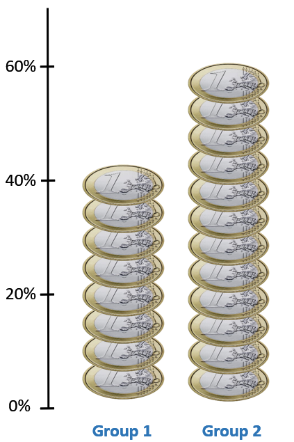

```{r globalsettings, echo=FALSE, warning=FALSE, results="hide"}
library(knitr)
opts_chunk$set(tidy.opts=list(width.cutoff=100),tidy=TRUE, warning = FALSE, message = FALSE,comment = "#>", cache=TRUE, echo=FALSE, class.source=c("test"), class.output=c("test2"))
options(width = 100)
library(rgl)
rgl::setupKnitr()
knitr::knit_hooks$set(webgl=hook_webgl)
```

```{css style settings, echo = FALSE}
blockquote {
    padding: 10px 20px;
    margin: 0 0 20px;
    font-size: 14px;
    border-left: 5px solid #eee;
    background-color: rgb(255,255,224,1);
}

.test {
  max-height: 300px;
  overflow-y: auto;
  overflow-x: auto;
  margin: 0px;
}

.test2 {
  max-height: 300px;
  overflow-y: auto;
  overflow-x: auto;
  margin: 0px;
  background-color: white;
  color: rgb(201, 76, 76);
}


h1, .h1, h2, .h2, h3, .h3 {
  margin-top: 24px;
}


```

```{r colorize, echo=FALSE}
colorize <- function(x, color) {
  if (knitr::is_latex_output()) {
    sprintf("\\textcolor{%s}{%s}", color, x)
  } else if (knitr::is_html_output()) {
    sprintf("<span style='color: %s;'>%s</span>", color, 
            x)
  } else x
}

```

```{r klippy, echo=FALSE, include=TRUE}
klippy::klippy(position = c('top', 'right'))
#klippy::klippy(color = 'darkred')
#klippy::klippy(tooltip_message = 'Click to copy', tooltip_success = 'Done')
```


---


This [website](https://jochemtolsma.github.io/JCA/) is a replication package for the presentation at JCA by [@Tolsma2022].

It contains R code to replicate all the Figures.

To copy the code click the button in the upper right corner of the code-chunks.

Use the top menu to navigate to the section of interest. 

The source code of this website can be found on [Github](https://github.com/JochemTolsma/JCA)

Questions can be addressed to [Jochem Tolsma](mailto:jochem.tolsma@ru.nl).


**A big *Thank You* to `r colorize("Thijmen Jeroense", "red")` for preparing the LISS data!**  

--- 

 <br> <br> <br> <br> <br> 


```{r, echo=FALSE, results='hide'}
fpackage.check <- function(packages) {
  lapply(packages, FUN = function(x) {
    if (!require(x, character.only = TRUE)) {
      install.packages(x, dependencies = TRUE)
      library(x, character.only = TRUE)
    }
  })
}

packages = c("VennDiagram", "EnvStats")

fpackage.check(packages)
```

# Introduction 

- My chair, supported by the James Coleman Association, has the title: **Social Divisions Between Groups**. 


```{r, fig.cap="Figure 1. Social Divisions Between Groups"}

# create Venn diagram with three sets
v <- draw.triple.venn(area1=40, area2=40, area3=40,
				n12=10, n23=10, n13=10, n123=5,
				category=c("Inequality","Polarization", "Segregation"), cat.dist = -.1, cat.cex=1.5,
				col="Red",fill=c("Green","Yellow","Blue"),
				lwd=3,
				alpha = .3,
				label.col = "dark red",
				cex=1.2,
				lty=2, 
				ind = FALSE)

#lapply(v, names)
#lapply(v, function(i) i$label)
v[[7]]$label <- ""
v[[8]]$label <- ""
v[[9]]$label <- ""
v[[10]]$label <- ""
v[[11]]$label <- "Social Divisions \n Between Groups"
v[[12]]$label <- ""
v[[13]]$label <- ""

grid.newpage()
grid.draw(v)
grid.newpage()

```

---  

# Inequality

The unequal distribution of resources. 
<!---
<iframe src="https://jtolsma.shinyapps.io/Gini2/" height="405" width="720" style="border: 1px solid #464646;" allowfullscreen="" allow="autoplay"></iframe>
---> 

```{r, fig.cap="Figure 2. Inequality" , out.width = '50%'}

```


---  

# Polarization

The unequal distribution of opinions. 


```{r, fig.cap="Figure 3. Polarization"}
set.seed(1234)

dat <- data.frame(group = factor(rep(c("group A","group B"), each=200)), 
                   opinion = c(rnormTrunc(200, mean = 1, sd = 1, min = 0, max = 7),rnormTrunc(200, mean = 6, sd = 1, min = 0, max = 7)))
 
# Density plots with semi-transparent fill
ggplot(dat, aes(x=opinion, fill=group)) +
  geom_density(alpha=.3, kernel="o") +
  scale_x_continuous(breaks = 0:7, limits = c(-1,8) , labels = c("totally disagree", "", "","", "", "", "", "totally agree")) 
```


--- 


# Segregation

The unequal distribution of positions. 


```{r, webgl=TRUE, fig.cap="segregation"}

#clean up
rm(list = ls())

#install.packages(c('rgl','spdep','geosphere','truncnorm'))
library(rgl)
require(spdep)
require(geosphere)
require(truncnorm)
require(base)

#define some colors
red=rgb(1,0,0); green=rgb(0,1,0); blue=rgb(0,0,1); white=rgb(1,1,1) ; black=rgb(0,0,0)
RtoWrange<-colorRampPalette(c(red, white ) )
BtoGrange<-colorRampPalette(c(black, green) )

############Model#################
#function define world
iniworld <- function(N=2000, cn=4, h=1, tc=.9, pg=c(0.5,0.5), distropTN=TRUE, plotworld=TRUE) {
	#N= number of agents (even number)
	#cn= number of clusters (even number)
	#h= cluster homogeneity (0.5-1)
	#tc= thinning constant. .9 means retain 90%
	#pg= proportion of groups; length is number of groups
	#distropTN= use truncated normal to generate opinions, default = false

	#in paper opinions [0,1], here [-1,1]
	#in paper tc is 1 - tc

	#functions
	spher_to_cart <- function(r, theta, phi) {
		x=r*cos(phi)*sin(theta)
		y=r*sin(theta)*sin(phi)
		z=r*cos(theta)
		coordinatesxyz <- matrix(c(x,y,z), ncol=3)
		return(coordinatesxyz)
	}

	distl <- function(x) {distVincentySphere(x, matlonglat, r=1)}

	#if tc<1 we need to increase initial N, make sure to keep even number
	if (tc<1) { N <- trunc(N/(tc*10)) * 10 }

	#define (random) position of agents on sphere:
	#http://mathworld.wolfram.com/SpherePointPicking.html
	r <- 1
	phi <- 2*pi*runif(N)
	theta <- acos(2*runif(N) - 1)
	coordinatesxyz <- spher_to_cart(r, theta, phi)

	phi_r <- (360*phi)/(2*pi)
	theta_r <- (180*theta)/pi
	lat <- 90 - theta_r
	long <- ifelse(phi_r>=0 & phi_r<180, -phi_r, abs(phi_r - 360))

	matlonglat <- matrix(c(long,lat), ncol=2)

	#improve: we only need to calculate half
	matlonglatlist <- lapply(seq_len(nrow(matlonglat)), function(i) matlonglat[i,])

	distl <- function(x) {distVincentySphere(x, matlonglat, r=1)}

	matdist <- sapply(matlonglatlist, distl)

	#model segregation: could be improved. check existing packages.
	parents <- sample(1:N, cn)
	groups <- rep(NA, N)
	#fix if cn==1
	groups[parents] <- sample(c(rep(1, round(cn*pg[1])),rep(-1, cn - round(cn*pg[1]))), cn, replace=FALSE)

	#to whom do children belong
	clusterchildren <- rep(NA, N)

	for (i in c(1:N))	{
		if (!(i %in% parents)) 	{
			#which parents is closest
			clusterchildren[i] <- parents[which(matdist[i,parents]==min(matdist[i,parents]))]
			#give child same initial value as closest parent
			group <- groups[clusterchildren[i]]
			#change value child depending of cluster homogeneity
			groups[i] <- ifelse(group==-1 ,sample(c(-1,1), 1, prob=c(h,1-h)), sample(c(-1,1), 1, prob=c(1-h,h)))
		}
	}

	#define opinions of agents
	if(distropTN==TRUE) {opinions <- rtruncnorm(N, a=-1, b=1, mean=0, sd=0.45)}
	#if(distropTN==FALSE) {opinions <- runif(N, min = -1, max = 1)}

	#for (future) plotting
	color <- ifelse(groups==1, "blue", "red")

	#thin clusters, make cluster boundaries sharper
	if (tc<1) {
		childIDi <- sampletc <- NA
		#put in big function
		for (i in 1:cn) {
			childIDi <- which(clusterchildren==parents[i])
			distchildparenti <- matdist[parents[i], childIDi ]
			#samplei <- sample(childIDi, trunc(tc*length(childIDi)), prob=exp(-distchildparenti)^2)
			cutoffdistance <- quantile(distchildparenti, tc)
			samplei <- childIDi[distchildparenti<cutoffdistance]
			sampletc <- c(sampletc,samplei)
		}
		clusterchildren <- sampletc <- sampletc[-1]
		sampletc <- c(sampletc,parents)
		N <- length(sampletc)
	}

	if (tc==1) { sampletc <- NA }

	if (plotworld & tc==1) {
		.check3d()
		rgl.close()
		plot3d(coordinatesxyz, col=color, box=FALSE, axes=FALSE, xlab="", ylab="", zlab="", size=8, xlim=c(-1,1) , ylim=c(-1,1), zlim=c(-1,1))
		rgl.spheres(0,0,0,radius=.995,color="grey")
	}

	if (tc==1) {
		worldlist <- list(coordinatesxyz, color, groups, opinions, matdist, N, cn, h, parents, clusterchildren, matlonglat, matlonglatlist, long, lat)
		names(worldlist) <- c("coordinatesxyz", "color", "groups", "opinions", "matdist", "N", "cn", "h", "parents", "clusterchildren", "matlonglat", "matlonglatlist", "long", "lat")
		#return(worldlist)
	}

	if (plotworld & tc<1) {
		.check3d()
		rgl.close()
		plot3d(coordinatesxyz[sampletc,], col=color[sampletc], box=FALSE, axes=FALSE, xlab="", ylab="", zlab="", size=8, xlim=c(-1,1) , ylim=c(-1,1), zlim=c(-1,1))
		rgl.spheres(0,0,0,radius=.995,color="grey")
	}


	if (tc<1) {
		worldlist <- list(coordinatesxyz[sampletc,], color[sampletc], groups[sampletc], opinions[sampletc], matdist[sampletc,sampletc], N, cn, h, parents, clusterchildren, matlonglat[sampletc,], matlonglatlist[sampletc], long[sampletc], lat[sampletc], tc)
		names(worldlist) <- c("coordinatesxyz", "color", "groups", "opinions", "matdist", "N", "cn", "h", "parents", "clusterchildren", "matlonglat", "matlonglatlist", "long", "lat", "tc")
		#return(worldlist)
	}


}

iniworld(N=2000, cn=16, h=0.9, tc=0.8, pg=c(0.7, 0.3), distropTN=TRUE, plotworld=TRUE)
```

Figure 4. Segregation

---   


## Segregation along different social dimensions

* Class  
* Religion  
* Ethnicity  
* Age  
* Gender  
* Education  

## Segregation in different social contexts. 

* Geographical areas  
* Schools  
* Work  
* Social Networks  

# Why segregation?  

- We don't know much about trends in segregation:  
  * Is it increasing or decreasing over time?  
  * Along which social dimension is segregation most prominent and does this change over time?  
  * Within which social context is segregation most prominent and does this change over time?  
  * Is segregation mainly the result of polarization and inequality or the cause for polarization and inequality?  
  * Do we need to take action and, if so, through which policies? 

---  


# References
