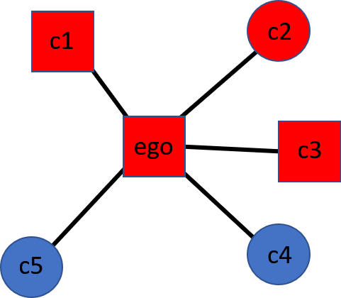

```{r globalsettings, echo=FALSE, warning=FALSE, message=FALSE, results="hide"}
library(knitr)
opts_chunk$set(tidy.opts=list(width.cutoff=100),tidy=TRUE, warning = FALSE, message = FALSE,comment = "#>", cache=TRUE, echo=FALSE, class.source=c("test"), class.output=c("test2"))
options(width = 100)
rgl::setupKnitr()
```

```{r colorize, echo=FALSE}
colorize <- function(x, color) {
  if (knitr::is_latex_output()) {
    sprintf("\\textcolor{%s}{%s}", color, x)
  } else if (knitr::is_html_output()) {
    sprintf("<span style='color: %s;'>%s</span>", color, 
            x)
  } else x
}

```

```{r klippy, echo=FALSE, include=TRUE}
klippy::klippy(position = c('top', 'right'))
#klippy::klippy(color = 'darkred')
#klippy::klippy(tooltip_message = 'Click to copy', tooltip_success = 'Done')
```

```{css style settings, echo = FALSE}
blockquote {
    padding: 10px 20px;
    margin: 0 0 20px;
    font-size: 14px;
    border-left: 5px solid #eee;
    background-color: rgb(255,255,224,1);
}

.test {
  max-height: 300px;
  overflow-y: auto;
  overflow-x: auto;
  margin: 0px;
}

.test2 {
  max-height: 300px;
  overflow-y: auto;
  overflow-x: auto;
  margin: 0px;
  background-color: white;
  color: rgb(201, 76, 76);
}


h1, .h1, h2, .h2, h3, .h3 {
  margin-top: 24px;
}


```

```{r, results='hide', echo=FALSE}
fpackage.check <- function(packages) {
  lapply(packages, FUN = function(x) {
    if (!require(x, character.only = TRUE)) {
      install.packages(x, dependencies = TRUE)
      library(x, character.only = TRUE)
    }
  })
}


```


```{r, results='hide', echo=FALSE}
packages = c("tidyverse", "haven", "Hmisc", "plotly")

fpackage.check(packages)

```

--- 

# LISS  


<a href="https://www.lissdata.nl/">
  
  </a>

---  

## Dependent variables

### **Core Discussion Network**
 
> We would like to concentrate on your closest contacts now, to form a picture of the social relationships that people have.  
> It is easier to answer these types of questions by considering concrete persons.  
> For that reason, we ask that you list a number of persons close to you. If you wish, you can enter nicknames or initials, as long as you can remember who they refer to.  
> Most people discuss important things with other people.  
> If you look back on the last six months, with whom did you discuss important things?  
> Please enter their first names below (to a maximum of 5).  


```{r cdn, echo=FALSE, fig.cap="Figure 4. CDN", out.width = '50%'}

```
<br> 

### **CDN homogeneity** 

To measure the degree of homogeneity within the CDN we use the (reversed) Krackhard and Stern's E-I index [@krackhardt1988]. This measure captures the relative prevalence of between-group ties ($E$) and within-group ties ($I$). It can thus be interpreted as a measure of network segregation.  

E-I Index: $EI = - \frac{E-I}{E+I}$  

We use a reversed version, so higher scores indicate more homogeneity: 

- 1 is maximum homogeneity  
- -1 is maximum heterogeneity  


For Figure 4:  

* Color homogeneity = $- \frac{2-3}{2+3}$ = +0.2.  
* Shape homogeneity = $- \frac{3-2}{2+3}$ = -0.2.  


---  

## Independent variables

- Education: 
    * low (primary, vmbo)  
    * medium (MBO, HAVO, VWO)  
    * Professional college (HBO)  
    * University   
- Gender:
    * male  
    * female  
- Age: 
    * birth year  
    * five year categories  
- Ethnicity:  
    * native Dutch  
    * non-western  
    * western  


---  

## Representivity

<!---
Thijmen, how do I know ego participated?: just select on missings
how do I know that an alter is mentioned?: check alter_id NA
--->

LISS representative with respect to eductional level measured in five categories? 

```{r, echo=TRUE, results='hold'}

load(file="./data/liss_merged_core_file_v3_0921.Rdata")

sample_val <- NA
sample_val[1] <- (table(liss_wide$oplcat.11))[1]
sample_val[2] <- (table(liss_wide$oplcat.11))[2]
sample_val[3] <- (table(liss_wide$oplcat.11))[3] + (table(liss_wide$oplcat.11))[4]
sample_val[4] <- (table(liss_wide$oplcat.11))[5]
sample_val[5] <- (table(liss_wide$oplcat.11))[6]


#cbs https://opendata.cbs.nl/#/CBS/nl/dataset/82816NED/table?ts=1646133108517
datacbs <- c(1265,	2847,	5211,	3122,	1850)
levels(datacbs) <- c("primair", "vmbo", "havo/vwo/mbo", "hbo", "wo")
#round(datacbs / sum(datacbs),2)
pop_val <- datacbs / sum(datacbs)

test <- chisq.test(x=sample_val, p=pop_val, rescale.p = TRUE)
test_data <- data.frame(round(test$observed),round(test$expected), c("primair", "vmbo", "havo/vwo/mbo", "hbo", "wo"))
names(test_data) <- c("observed (LISS)", "expected (CBS)", "levels")
test_data
test

rm(list=ls())
```

Nope, but nothing really problematic. 

---  

<!---
## Data prep. 

We prepared two datasets, one in which we included all alters and one in which we excluded kin-alters. 
This presentation we will use infomration on all alters. 
---> 

# Some data wrangling  

```{r, echo=TRUE, eval=FALSE}
load(file="./data/liss_jca_jochem_V1.rds")

liss_long %>%
  mutate(#size
        #cdn_size = 5 - rowSums(is.na(cbind(alter_id_1, alter_id_2, alter_id_3, alter_id_4, alter_id_5))),
        cdn_size = 5 - rowSums(is.na(cbind(gender_alter1, gender_alter2, gender_alter3, gender_alter4, gender_alter5))),
        #education
        opl4 = recode(as.numeric(oplmet), '1' = 1, '2'=1, '3'= 2, '4' = 2, '5' = 3, '6'=4, .default=-1 ),
        opl4 = na_if(opl4, -1), 
        opl4 = structure(opl4, labels=c("low", "medium", "high1", "high2")),
         across(c(educ_recode_alter1,educ_recode_alter2,educ_recode_alter3,educ_recode_alter4,educ_recode_alter5), ~as.numeric(.x), .names = "{.col}_opl4"),
         across(c(educ_recode_alter1_opl4,educ_recode_alter2_opl4,educ_recode_alter3_opl4,educ_recode_alter4_opl4,educ_recode_alter5_opl4), ~recode(.x, '4'=1, '6'=1, '10'=2, '10.5'=2, '11.5'=2 , '15'=3, '16' = 4, .default=-1)),
         across(c(educ_recode_alter1_opl4,educ_recode_alter2_opl4,educ_recode_alter3_opl4,educ_recode_alter4_opl4,educ_recode_alter5_opl4), ~na_if(.x, -1)),
         educ_I = rowSums(cbind(educ_recode_alter1_opl4,educ_recode_alter2_opl4,educ_recode_alter3_opl4,educ_recode_alter4_opl4,educ_recode_alter5_opl4)==opl4,na.rm=T),
         educ_E = rowSums(cbind(educ_recode_alter1_opl4,educ_recode_alter2_opl4,educ_recode_alter3_opl4,educ_recode_alter4_opl4,educ_recode_alter5_opl4)!=opl4,na.rm=T),
         educ_EI =  - ((educ_E - educ_I) / (educ_E + educ_I)),
         cdn_neduc_h = rowSums(cbind(educ_recode_alter1, educ_recode_alter2, educ_recode_alter3, educ_recode_alter4, educ_recode_alter5)==16, na.rm=T),
        
        #gender   
         gender_alter1 = replace_na(gender_alter1, -1),
         gender_alter2 = replace_na(gender_alter2, -1),
         gender_alter3 = replace_na(gender_alter3, -1),
         gender_alter4 = replace_na(gender_alter4, -1),
         gender_alter5 = replace_na(gender_alter5, -1),
         cdn_ngender_2 = rowSums(cbind(gender_alter1, gender_alter2, gender_alter3, gender_alter4, gender_alter5)==2, na.rm=T),
         cdn_ngender_1 = rowSums(cbind(gender_alter1, gender_alter2, gender_alter3, gender_alter4, gender_alter5)==1, na.rm=T),
         gender_I = ifelse(geslacht==2, cdn_ngender_2, cdn_ngender_1),
         gender_E = ifelse(geslacht==1, cdn_ngender_2, cdn_ngender_1),
         gender_EI =  - ((gender_E - gender_I) / (gender_E + gender_I)),
        
        #age
        across(c(age_alter1, age_alter2, age_alter3, age_alter4, age_alter5), ~na_if(.x, 14)),
        across(c(age_alter1, age_alter2, age_alter3, age_alter4, age_alter5), ~as.integer(.x)),
        leeftijd_cat13 = as.integer(cut(as.numeric(liss_long$leeftijd),breaks = c(-Inf, 15, 20, 25, 30, 35, 40,45,50,55,60,65,70, Inf))),
        leeftijd_I = rowSums(cbind(age_alter1, age_alter2, age_alter3, age_alter4, age_alter5)==leeftijd_cat13, na.rm=T),
        leeftijd_E = rowSums(cbind(age_alter1, age_alter2, age_alter3, age_alter4, age_alter5)!=leeftijd_cat13, na.rm=T),
        leeftijd_EI =  - ((leeftijd_E - leeftijd_I) / (leeftijd_E + leeftijd_I)),
        
        #etni
        etni3 = recode(as.numeric(origin), '0' = 1, '101'=2, '102'= 3, '201' = 2, '202' = 3, '999'=-1, .default=-1 ),
        etni3 = na_if(etni3, -1), 
        etni3 = structure(etni3, labels=c("D", "W", "NW")),
         across(c(origin_alter1,origin_alter2,origin_alter3,origin_alter4,origin_alter5), ~as.numeric(.x), .names = "{.col}_etni3"),
         across(c(origin_alter1_etni3,origin_alter2_etni3,origin_alter3_etni3,origin_alter4_etni3,origin_alter5_etni3), ~recode(.x, '1'=1, '2'=3, '3'=3, '4'=3, '5'=3 , '6'=2, '7' = 3, '8' = 2, '9' = -1, .default=-1)),
         across(c(origin_alter1_etni3,origin_alter2_etni3,origin_alter3_etni3,origin_alter4_etni3,origin_alter5_etni3), ~na_if(.x, -1)),
         etni_I = rowSums(cbind(origin_alter1_etni3, origin_alter2_etni3, origin_alter3_etni3, origin_alter4_etni3 ,origin_alter5_etni3)==etni3, na.rm=T),
         etni_E = rowSums(cbind(origin_alter1_etni3,origin_alter2_etni3,origin_alter3_etni3,origin_alter4_etni3,origin_alter5_etni3)!=etni3, na.rm=T),
         etni_EI =  - ((etni_E - etni_I) / (etni_E + etni_I)),
        
          ego_id = nomem_encr) %>%
  filter(!is.na(pol_int))   %>%
  select(ego_id,  survey_wave, leeftijd, leeftijd_cat13,  opl4, geslacht, etni3, cdn_size, educ_EI, gender_EI, leeftijd_EI, etni_EI ) -> datajt

#make similar dataset for non-kin. dus gooi alle alters weg met rel_alter - 1 2,3,4,5
# quickest would probably be to go from wide to long, select and go back to wide. but...

liss_long %>%
  mutate(across(c(rel_alter1,rel_alter2,rel_alter3,rel_alter4,rel_alter5), ~replace_na(.x, -1)),
         #alter_id_1 = ifelse(rel_alter1>0 & rel_alter1<6, NA, alter_id_1), 
         #alter_id_2 = ifelse(rel_alter2>0 & rel_alter2<6, NA, alter_id_2), 
         #alter_id_3 = ifelse(rel_alter3>0 & rel_alter3<6, NA, alter_id_3), 
         #alter_id_4 = ifelse(rel_alter4>0 & rel_alter4<6, NA, alter_id_4), 
         #alter_id_5 = ifelse(rel_alter5>0 & rel_alter5<6, NA, alter_id_5), 
         
         educ_recode_alter1 = ifelse(rel_alter1>0 & rel_alter1<6, NA, educ_recode_alter1), 
         educ_recode_alter2 = ifelse(rel_alter2>0 & rel_alter2<6, NA, educ_recode_alter2), 
         educ_recode_alter3 = ifelse(rel_alter3>0 & rel_alter3<6, NA, educ_recode_alter3), 
         educ_recode_alter4 = ifelse(rel_alter4>0 & rel_alter4<6, NA, educ_recode_alter4), 
         educ_recode_alter5 = ifelse(rel_alter5>0 & rel_alter5<6, NA, educ_recode_alter5), 
         
         gender_alter1 = ifelse(rel_alter1>0 & rel_alter1<6, NA, gender_alter1), 
         gender_alter2 = ifelse(rel_alter2>0 & rel_alter2<6, NA, gender_alter2), 
         gender_alter3 = ifelse(rel_alter3>0 & rel_alter3<6, NA, gender_alter3), 
         gender_alter4 = ifelse(rel_alter4>0 & rel_alter4<6, NA, gender_alter4), 
         gender_alter5 = ifelse(rel_alter5>0 & rel_alter5<6, NA, gender_alter5),
         
         origin_alter1 = ifelse(rel_alter1>0 & rel_alter1<6, NA, origin_alter1), 
         origin_alter2 = ifelse(rel_alter2>0 & rel_alter2<6, NA, origin_alter2), 
         origin_alter3 = ifelse(rel_alter3>0 & rel_alter3<6, NA, origin_alter3), 
         origin_alter4 = ifelse(rel_alter4>0 & rel_alter4<6, NA, origin_alter4), 
         origin_alter5 = ifelse(rel_alter5>0 & rel_alter5<6, NA, origin_alter5),
         
         age_alter1 = ifelse(rel_alter1>0 & rel_alter1<6, NA, age_alter1), 
         age_alter2 = ifelse(rel_alter2>0 & rel_alter2<6, NA, age_alter2), 
         age_alter3 = ifelse(rel_alter3>0 & rel_alter3<6, NA, age_alter3), 
         age_alter4 = ifelse(rel_alter4>0 & rel_alter4<6, NA, age_alter4), 
         age_alter5 = ifelse(rel_alter5>0 & rel_alter5<6, NA, age_alter5),
         
         
         ) %>%


 mutate(#size
        #cdn_size = 5 - rowSums(is.na(cbind(alter_id_1, alter_id_2, alter_id_3, alter_id_4, alter_id_5))),
        cdn_size = 5 - rowSums(is.na(cbind(gender_alter1, gender_alter2, gender_alter3, gender_alter4, gender_alter5))),
        #education
        opl4 = recode(as.numeric(oplmet), '1' = 1, '2'=1, '3'= 2, '4' = 2, '5' = 3, '6'=4, .default=-1 ),
        opl4 = na_if(opl4, -1), 
        opl4 = structure(opl4, labels=c("low", "medium", "high1", "high2")),
         across(c(educ_recode_alter1,educ_recode_alter2,educ_recode_alter3,educ_recode_alter4,educ_recode_alter5), ~as.numeric(.x), .names = "{.col}_opl4"),
         across(c(educ_recode_alter1_opl4,educ_recode_alter2_opl4,educ_recode_alter3_opl4,educ_recode_alter4_opl4,educ_recode_alter5_opl4), ~recode(.x, '4'=1, '6'=1, '10'=2, '10.5'=2, '11.5'=2 , '15'=3, '16' = 4, .default=-1)),
         across(c(educ_recode_alter1_opl4,educ_recode_alter2_opl4,educ_recode_alter3_opl4,educ_recode_alter4_opl4,educ_recode_alter5_opl4), ~na_if(.x, -1)),
         educ_I = rowSums(cbind(educ_recode_alter1_opl4,educ_recode_alter2_opl4,educ_recode_alter3_opl4,educ_recode_alter4_opl4,educ_recode_alter5_opl4)==opl4,na.rm=T),
         educ_E = rowSums(cbind(educ_recode_alter1_opl4,educ_recode_alter2_opl4,educ_recode_alter3_opl4,educ_recode_alter4_opl4,educ_recode_alter5_opl4)!=opl4,na.rm=T),
         educ_EI =  - ((educ_E - educ_I) / (educ_E + educ_I)),
         cdn_neduc_h = rowSums(cbind(educ_recode_alter1, educ_recode_alter2, educ_recode_alter3, educ_recode_alter4, educ_recode_alter5)==16, na.rm=T),
        
        #gender   
         gender_alter1 = replace_na(gender_alter1, -1),
         gender_alter2 = replace_na(gender_alter2, -1),
         gender_alter3 = replace_na(gender_alter3, -1),
         gender_alter4 = replace_na(gender_alter4, -1),
         gender_alter5 = replace_na(gender_alter5, -1),
         cdn_ngender_2 = rowSums(cbind(gender_alter1, gender_alter2, gender_alter3, gender_alter4, gender_alter5)==2, na.rm=T),
         cdn_ngender_1 = rowSums(cbind(gender_alter1, gender_alter2, gender_alter3, gender_alter4, gender_alter5)==1, na.rm=T),
         gender_I = ifelse(geslacht==2, cdn_ngender_2, cdn_ngender_1),
         gender_E = ifelse(geslacht==1, cdn_ngender_2, cdn_ngender_1),
         gender_EI =  - ((gender_E - gender_I) / (gender_E + gender_I)),
        
        #age
        across(c(age_alter1, age_alter2, age_alter3, age_alter4, age_alter5), ~na_if(.x, 14)),
        across(c(age_alter1, age_alter2, age_alter3, age_alter4, age_alter5), ~as.integer(.x)),
        leeftijd_cat13 = as.integer(cut(as.numeric(liss_long$leeftijd),breaks = c(-Inf, 15, 20, 25, 30, 35, 40,45,50,55,60,65,70, Inf))),
        leeftijd_I = rowSums(cbind(age_alter1, age_alter2, age_alter3, age_alter4, age_alter5)==leeftijd_cat13, na.rm=T),
        leeftijd_E = rowSums(cbind(age_alter1, age_alter2, age_alter3, age_alter4, age_alter5)!=leeftijd_cat13, na.rm=T),
        leeftijd_EI =  - ((leeftijd_E - leeftijd_I) / (leeftijd_E + leeftijd_I)),
        
        #etni
        etni3 = recode(as.numeric(origin), '0' = 1, '101'=2, '102'= 3, '201' = 2, '202' = 3, '999'=-1, .default=-1 ),
        etni3 = na_if(etni3, -1), 
        etni3 = structure(etni3, labels=c("D", "W", "NW")),
         across(c(origin_alter1,origin_alter2,origin_alter3,origin_alter4,origin_alter5), ~as.numeric(.x), .names = "{.col}_etni3"),
         across(c(origin_alter1_etni3,origin_alter2_etni3,origin_alter3_etni3,origin_alter4_etni3,origin_alter5_etni3), ~recode(.x, '1'=1, '2'=3, '3'=3, '4'=3, '5'=3 , '6'=2, '7' = 3, '8' = 2, '9' = -1, .default=-1)),
         across(c(origin_alter1_etni3,origin_alter2_etni3,origin_alter3_etni3,origin_alter4_etni3,origin_alter5_etni3), ~na_if(.x, -1)),
         etni_I = rowSums(cbind(origin_alter1_etni3, origin_alter2_etni3, origin_alter3_etni3, origin_alter4_etni3 ,origin_alter5_etni3)==etni3, na.rm=T),
         etni_E = rowSums(cbind(origin_alter1_etni3,origin_alter2_etni3,origin_alter3_etni3,origin_alter4_etni3,origin_alter5_etni3)!=etni3, na.rm=T),
         etni_EI =  - ((etni_E - etni_I) / (etni_E + etni_I)),
        
          ego_id = nomem_encr) %>%
  filter(!is.na(pol_int))   %>%
  select(ego_id,  survey_wave, leeftijd, leeftijd_cat13,  opl4, geslacht, etni3, cdn_size, educ_EI, gender_EI, leeftijd_EI, etni_EI )-> datajt_nk


test <- cut(as.numeric(liss_long$leeftijd),breaks = c(-Inf, 15, 20, 25, 30, 35, 40,45,50,55,60,65,70, Inf))
#levels(test)

save(datajt, file="./data/datajt.rda")
save(datajt_nk, file="./data/datajt_nk.rda")

rm(list=ls())  
```

--- 

# References
